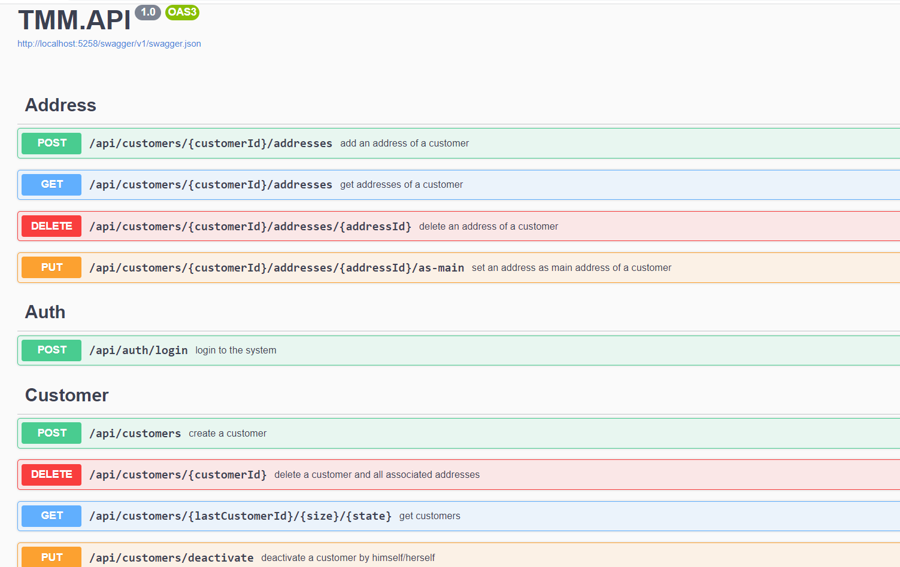
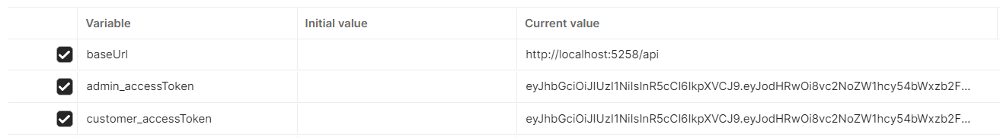
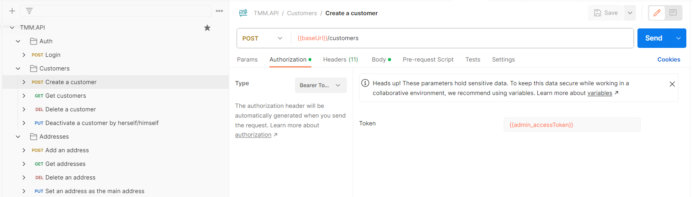
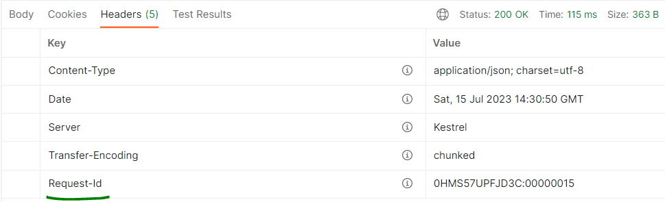

# Prerequisites
.Net SDK 6.0. <br/>
SQL Server- If you prefer not to use the in-memory database. <br/>
Postman. <br/> <br/>

# Running the application

Please go to the TMM.API directory and in command prompt or PowerShell execute the following command.

``` dotnet run --port 5258```

<br/><br/>



# Database
Configurations related to the database in the appsettings.json file.

```json
"DB": {
    "UseInMemory": true,
    "InMemoryDBName": "TMM-DB",
    "SQLConnection": "" //If UseInMemory value is false, SQLConnection should be set.
  }
```
The script related to the migration of SQL Server tables is located in the Install.sql file.
<br/><br/>
# Application Users
There are two types of users : Admin and Customers. <br/>
According to the technical test document, all APIs should be called by Admin, except the API that "can be marked as disabled by the customer if requested by the customer". Therefore, this service can only be called with the customer access_token.
<br/><br/>
A list of default admins is defined in the admins.json file.

```json
{
  "Admins": [
    {
      "UserId": -1,
      "MobileNo": "+989302794244",
      "Password": "Saman" //forename
    },
    {
      "UserId": -2,
      "MobileNo": "+4410000000",
      "Password": "Chris" //forename
    },
    {
      "UserId": -3,
      "MobileNo": "+5530000000",
      "Password": "Alvaro" //forename
    }
  ]
}
```
<br/>
As you can see, users login to the application with their mobile number and forename (as their password). It is the same for customers after being added to the application. It should be noted that this method has been used for the ease of login and access token generation, and it is definitely not recommended for the production environment.
<br/> And also, the UserId of the admins is considered to be a negative number so as not to be duplicated with the UserId of the customers.

# Postman

List of variables


<br/><br/>

List of HTTP requests 



The script related to the APIs of Postman HTTP requests is located in the TMM.API.postman_collection.json file. <br/>


# Observability

Logger configurations in the appsettings.json file: 

```json
 "WriteTo": [
        {
          "Name": "File",
          "Args": {
            "path": "../../Logs/TMMAPI-.log",
            "rollingInterval": "Hour",
            "outputTemplate": "{Timestamp:yyyy-MM-dd HH:mm:ss.fff zzz} {RequestId} {Level:u3} {UserId} {Message:lj}{NewLine}{Exception}"
          }
        }
      ]
```

In each HTTP request with a status code other than 200-OK, a response with the following structure is returned.
```json
{
    "type": "customer-does-not-exist",
    "status": 400,
    "detail": "There isn't a customer with that property.",
    "instance": "/api/customers/1/addresses/1",
    "request-id": "0HMS585O45Q25:00000002"
}
```
With the request-id, you can trace whole steps of your request in log file or any other log storage like ELK Stack. <br/>
And also, in each request whether success or failed, you can access to the request-id using the response header.




